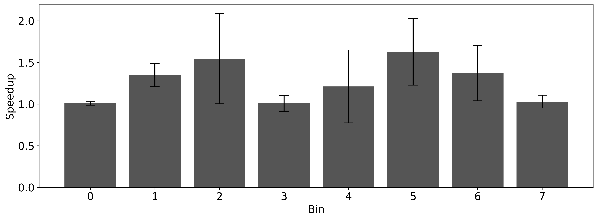
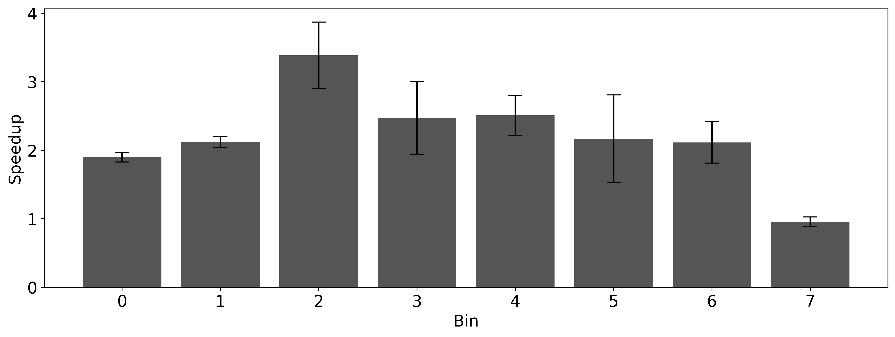

# Reproducing [Delay scheduling: a simple technique for achieving locality and fairness in cluster scheduling](https://dl.acm.org/doi/abs/10.1145/1755913.1755940)

> Distributed Data Processing Systems, assignment 1: reproducibility study

> by András Schmelczer & Leonardo Pohl

> Leiden University, 2021

## [Report](docs/report.pdf)

## Reproducing the reproducibility study on DAS-5

### Install

```sh
module load python/3.6.0
python3 -m venv --copies .env   
pip install -r requirements.txt
```

### Run
```sh
./start.sh
```
> Wait until the master node has started. Will run for a while, on `KeyboardInterrupt` it cleans up.

In a separate terminal, run:

```sh
python3 run_experiment.py
python3 process_experiment.py
python3 chart_experiment_1.py
python3 chart_experiment_2.py
```
## Results

### Figure 1

> CDFs of running times of jobs in various bin ranges in the IO-heavy workload. Fair sharing greatly improves performance for small jobs, at the cost of slowing the largest jobs. Delay scheduling further improves performance, especially for medium-sized jobs.

### Figure 2

> Average speedup of delay scheduling over **naive fair sharing** for jobs in each bin in the IO-heavy workload. The black lines show standard deviations.

### Figure 3


> Average speedup of delay scheduling over **FIFO scheduling** sharing for jobs in each bin in the IO-heavy workload. The black lines show standard deviations.
